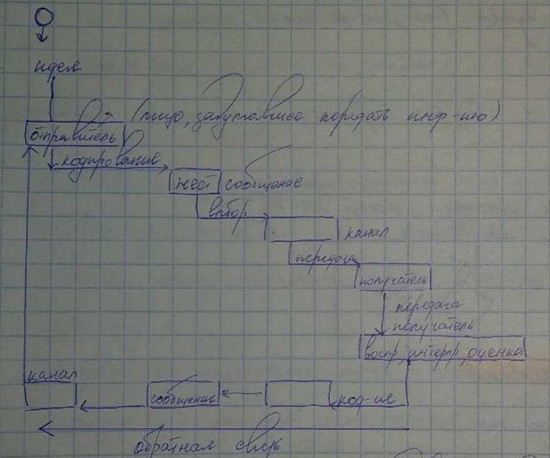

1. Понятие «общения» в психологии. Понятие коммуникации. 
2. Структура общения по Г. Н. Андреевой.
3. Механизмы межличностной перцепции (идентификация, эмпатия, аттракция, рефлексия, каузальная атрибуция).
4. Функции общения. Цели общения. 
5. Основные функции общения
6. Структура коммуникативного процесса. Различия между одно- и дву- сторонней коммуникациями.
7. Методика КОС-2
8. Модель коммуникативного процесса.
9. Формы организационных коммуникаций (внешние и внутренние)
10. Типы организационных сетей в организации.
11. Виды коммуникаций (по форме передачи информации, по количеству коммуникантов, по средствам, по направленности, по цели сообщения, по форме коммуникативного события)
12. Уровни коммуникации (императивный, манипулятивный, формальный, гуманистический духовный)
13. Манипулятивное воздействие (этапы, признаки, критерии распознавания, схема противостояния.
14. Невербальные средства в деловом общении. Значение невербальной коммуникации. Основные типы невербальной коммуникации.
15. Кинесика.
16. Просодика. Такесика. Проксемика.
17. Вербальные средства коммуникации в деловом общении. Функции языка.
18. Слушание в деловой коммуникации.
19. Деловая беседа как основная форма делового общения. Виды деловых бесед.
20. Проведение деловой беседы. Деловая беседа по телефону.
21. Этика деловой переписки.

---

### 1. Понятие «общения» в психологии. Понятие коммуникации. 

**Общение** - сложный многоплановый процесс установления и развития контактов между людьми (межличностное общение) и группами (межгрупповое общение), порождаемый потребностями совместной деятельности.

**Коммуникация** - процесс обмена мыслями, фактами, идеями или эмоциями между двумя или более людьми.

--- 

### 2. Структура общения по Г. Н. Андреевой.

Структура представляет из себя треугольник.

* Коммуникативная - состоит в обмене информацией между общающимися индивидами.
* Интерактивная - заключается в обмене не только знаниями, идеями, но и действиями.
* Перцептивная - означает процесс восприятия друг друга партнерами по общению и установлению на этой основе взаимопонимания (идентификация, эмпатия, аттракция).

---

### 3. Механизмы межличностной перцепции (идентификация, эмпатия, аттракция, рефлексия, каузальная атрибуция).

* **Идентификация** - это способ познания другого человека на основе постановки себя на его место.
* **Эмпатия** - это эмоциональное сопереживание другому.
* **Аттракция** - это механизм самопознания в процессе общения на основе устойчивого позитивного чувства к партнёру.
* **Рефлексия** - это механизм самопознания, в основе которого лежит способность человека представлять как он воспринимается партнёром.
* **Каузальная атрибуция** - это прогнозирование поведения партнёра по общению. 

---

### 4. Функции общения. Цели общения. 

**Функции общения**

1. Обмен информацией;
2. Воздействие на людей;
3. Соблюдение социальных ценностей;
4. Выражение своих чувств;
5. Получение обратной связи о себе;

**Цели общения**

1. оказание помощи другому человеку;
2. получение помощи;
3. поиск партнера для беседы, совместной игры, деятельности и т.п. (т.е. партнера для взаимодействия);
4. поиск человека, от которого можно получить понимание, сочувствие, эмоциональный отклик, похвалу;
5. самовыражение (общение с теми, кто дает возможность проявить силу, ум, способности, умения);
6. приобщение другого (других) к своим или общечеловеческим ценностям (воспитание, обучение);
7. изменение мнения, намерения, поведения другого человека.

---

### 5. Основные функции общения

1. Информационная функция общения состоит в приеме и передачи информации. 
2. Контактная функция общения предполагает установление контакта. 
3. Интерактивная функция общения предусматривает не только передачу информации между людьми и само их взаимодействие, но также и определенное влияние на других людей.

---

### 6. Структура коммуникативного процесса. Различия между одно- и дву- сторонней коммуникациями.

Модель коммуникативного процесса на изображении.

При односторонней коммуникации передать информацию хочет только отправитель.

При двусторонней коммуникации передавать информацию могут оба участника.

Двусторонняя коммуникация характеризуется:
1. наличием обратной связи
2. более затратная по времени
3. отправитель и получатель меняются местами
4. возрастает возможность правильной интерпретации

---

### 7. Методика КОС-2

Данная методика предназначена для выявления коммуникативных и организаторских склонностей личности (умение четко и быстро устанавливать деловые и товарищеские контакты с людьми, стремление расширять контакты, участие в групповых мероприятиях, умение влиять на людей и т.д.).

1. Есть ли у Вас стремление к изучению людей и установлению знакомств с
различными людьми?
2. Нравится ли Вам заниматься общественной работой?
3. Долго ли Вас беспокоит чувство обиды, причиненной Вам кем-либо из
Ваших товарищей?
4. Всегда ли Вам трудно ориентироваться в создавшейся критической ситуации?
5. Много ли у Вас друзей, с которыми Вы постоянно общаетесь?
6. Часто ли Вам удается склонить большинство своих товарищей к принятию ими Вашего мнения?
7. Верно ли, что Вам приятнее и проще проводить время с книгами или за
какими-либо другими занятиями, чем с людьми?
8. Если возникли некоторые помехи в осуществлении Ваших намерений, то
легко ли Вам отказаться от своих намерений?
9. Легко ли Вы устанавливаете контакты с людьми, которые значительно
старше Вас по возрасту?
10. Любите ли Вы придумывать или организовывать со своими товарищами
различные игры и развлечения?
11. Трудно ли Вам включаться в новые для Вас компании (коллективы)?
12. Часто ли Вы откладываете на другие дни те дела, которые нужно было
бы выполнить сегодня?
13. Легко ли Вам удается устанавливать контакты и общаться с незнакомыми людьми?
14. Стремитесь ли Вы добиться, чтобы Ваши товарищи действовали в соответствии с Вашим мнением?
15. Трудно ли Вы осваиваетесь в новом коллективе?
16. Верно ли, что у Вас не бывает конфликтов с товарищами из-за невыполнения ими своих обещаний, обязательств, обязанностей?
17. Стремитесь ли Вы при удобном случае познакомиться и побеседовать с
новым человеком?
18. Часто ли в решении важных дел Вы принимаете инициативу на себя?
19. Раздражают ли Вас окружающие люди, и хочется ли Вам побыть одному?
20. Правда ли, что Вы обычно плохо ориентируетесь в незнакомой для Вас
обстановке?
21. Нравиться ли Вам постоянно находиться среди людей?
22. Возникает ли у Вас раздражение, если Вам не удается закончить начатое
дело?
23. Испытываете ли Вы чувство затруднения, неудобства или стеснения, если приходиться проявлять инициативу, чтобы познакомиться с новым человеком?
24. Правда ли, что Вы утомляетесь от частого общения с товарищами?
25. Любите ли Вы участвовать в коллективных играх?
26. Часто ли Вы проявляете инициативу при решении вопросов, затрагивающих интересы Ваших товарищей?
27. Правда ли, что Вы чувствуйте себя неуверенно среди мало знакомых
Вам людей?
28. Верно ли, что Вы редко стремитесь к доказательству своей правоты?
29. Полагаете ли, что Вам не представляет особого труда внести оживление
в мало знакомую для Вас группу?
30. Принимаете ли Вы участие в общественной работе?
31. Стремитесь ли Вы ограничить круг своих знакомых небольшим количеством людей?
32. Верно ли, что Вы не стремитесь отстаивать свое мнение или решение,
если оно не было принято сразу Вашими товарищами?
33. Чувствуете ли Вы себя непринужденно, попав в незнакомый для Вас
коллектив?
34. Охотно ли Вы приступаете к организации различных мероприятий для
своих товарищей?
35. Правда ли, что Вы не чувствуете себя достаточно уверенным и спокойным, когда приходится говорить что-либо большой группе людей?
36. Часто ли Вы опаздываете на деловые встречи, свидания?
37. Верно ли, что у Вас много друзей?
38. Часто ли Вы оказываетесь в центре внимания своих товарищей?
39. Часто ли Вы смущаетесь, чувствуете неловкость при общении с малознакомыми людьми?
40. Правда ли, что Вы не очень уверенно чувствуете себя в окружении
большой группы своих товарищей?

* 1-4 - очень низкий
* 5-8 - низкий
* 9-12 - средний
* 13-16 - высокий
* 17-20 - высший

---

### 8. Модель коммуникативного процесса.

---

### 9. Формы организационных коммуникаций (внешние и внутренние)

**Внешние**

1. Между организацией и средой
2. Первостепенное внимание
3. Создание имиджа
4. Создание репутации организации

**Внутренние**

1. Между людьми одного отдела
2. Между отделами
3. Между сотрудниками и руководством

---

### 10. Типы организационных сетей в организации.

Коммуникативная сеть - объединение участников коммуникационного процесса с помощью информационных потоков.

**Основные сети:**

1. "Звезда"
   1. Руководитель контролирует десятки подчинённых;
   2. **Преимущества:**
      1. Есть лидер, который несёт ответственность за всю работу. Сильная связь между подчинёнными и начальством;
      2. Высокая устойчивость;
      3. Быстрое решение задач, все сотрудники могут получать инструкции;
      4. Порядок, точность, жёсткий контроль;
      5. Главное знание принадлежит лидеру, его выбору;
   3. **Недостатки:**
      1. Отсутствует возможность инициативы;
2. "Круг"
   1. Полное равноправие;
   2. Решения принимаются совместно;
   3. Ответственность;
   4. Отсутствует формальный лидер, который всё контролирует;
   5. **Преимущества:**
      1. Благоприятный моральный климат;
      2. Благоприятная обстановка для творческой работы;
      3. Ограничивает "простаивание" информации;
      4. Даёт возможность эксперимента, риска;
      5. Воспитание будущих лидеров;
3. "Шпора" (Участник **Б** занимает руководящую должность, но имеет своего руководителя в лице участника **А**. **Б** является центром реальной власти сохраняя свои позиции до тех пор пока удовлетворяет интересам **А**. Главная проблема: правильный выбор **Б**);

---

### 11. Виды коммуникаций (по форме передачи информации, по количеству коммуникантов, по средствам, по направленности, по цели сообщения, по форме коммуникативного события)

1. **По форме:**
   1. **Монолог** - однонаправленная передача информации;
   2. **Диалог** - субъекты общения взаимодействуют, происходит обмен информацией. Выработка согласованных решений;
   3. **Палилог** - организация одностороннего общения, характеризуемая борьбой за овладение коммуникационной инициативой и связана с максимальной эффективностью её репутации;
2. **По количеству:**
   1. **Интерпретационная** - разраговор с самим собой, с внутренним голосом;
   2. **Межличностная** - участвует двое коммуникантов, допускается присутствие наблюдателя;
   3. **Групповая** - внутри группы, между группами, между группой и коммуникантами;
   4. **Массовая** - охватывает ограниченное количество людей различающихся по интересам. Бросок информации в массы и ожидание реакции (TV, СМИ, радио);
3. **По средствам:**
   1. **Вербальная** - устная и письменная речь;
   2. **Невербальная** - жесты, мимика, понтамимика, проксемика, все двигательные средства. Паралингвистические средства (около речевые), запахи, внешний вид, авторитарные, демократичные;
      1. **Открытые** - готовность к общению;
      2. **Закрытые** - не готовность к общению;
      3. **Включающие** - невербальные проявления, которые включают вербальную информацию;
      4. **Исключающие** - противоречат вербальным;
4. **По направленности:**
   1. **Прямая** - коммуникация, при которой партнёры направляют свои действия конкретно друг на друга. Восприятие информации от "первого лица";
      1. **Непосредственная** - естесственный контакт "лицом к лицу" при помощи вербальных и невербальных средств;
      2. **Опосредованная** - "не полный контакт", осуществляемый при помощи письменных и технических устройств;
   2. **Косвенная** - общение, в котором информация достигает партнёра не на прямую, а через других людей или действия, направленные на предмет окружающей среды;
5. **По цели сообщения:**
   1. **Позновательная** - целью является расширение информационного фонда партнёра, передать необходимую информацию (лекции, семинары, беседы, консультации);
   2. **Убеждающая** - целью является вызвать интерес у собеседника, определённые чувства, сформировать ценностные ориентации и установки избегая формы отрицания, сделать собеседника своим единомышленником (дискуссия, убеждения и призыв к действию, презентация);
   3. **Экспресивная** - целью является сформировать у партнёра психо-эмоциональный настрой, передать чувства переживания, побудить необходимость к действию (речи по специальному поводу, тренинги);
   4. **Суггестивная (внушающая)** - целью является оказание внушительного воздействия на партнёра для изменения его мотивации, ценностных ориентаций, поведения и отношения (беседы, митинги, реклама);
   5. **Ритуальная** - целью является сохранение традиций конкретной группы: семья, фирма (торжественные речи, ритуальные церемонии, посвящения);
6. **По форме коммуникационного события:**
   1. **Беседа**
   2. **Лекция** 
   3. **Митинг**
   4. **Другие**

---

### 12. Уровни коммуникации (императивный, манипулятивный, формальный, гуманистический духовный)

**Уровни коммуникации** - это определённый способ воздействия, в котором отображаются цели этого взаимодействия и характер взаимоотношения между людьми.

1. **Императивный (императивно-повелительный)** - представляет собой монолог. Говорящий обладает ресурсами и открыто принуждает партнёра по общению к выполнению своей цели. Партнёр рассматривается как объект. В качестве средств оказания влияния используются: приказ, указание, требование, распоряжение. Выбор данного уровня оправдан, если это военные отношения, начальник-подчинённый, экстримальные условия. Недопустим в системе воспитания и педагогике, супружеских отношениях;
2. **Манипулятивный** - предполагается неравенство в общении, но коммуникатор, использующий мунипулятивный уровень, не обладает достаточными ресурсами чтобы принуждать;
3. **Формальный** - требует поддержания контактов, используемых, когда коммуникация нежелательна или безралична. В организации формальное общение является основным каналом взаимодействия по которым поступает информация. Нет стремления понимать и учитывать особенности личности собеседника. Соблюдаются маски строгости и стандартный набор фраз, клише;
4. **Гумманистический** - отсутствует поддержка социальных связей, не демонстрирует доминирования, проявляется уважение к личности собеседника;
   1. **Игровой** - более сложная коммуникация, требует более тонкой настройки состояния партнёра и собственного поведения. Собеседники готовы к активному эмоциональному взаимодействию;
   2. **Деловой** - согласование людей с целью достижения общего результата. Партнёры концентрируются на обсуждении конкретных проблем, истинный интерес к информации;
5. **Духовный** - возможен между партнёрами, которые стремятся к внутреннему совершенству, расширения собственных возможностей. Обогащает собеседников и способствует духовному саморазвитию;

---

### 13. Манипулятивное воздействие (этапы, признаки, критерии распознавания, схема противостояния).

#### Этапы

1. Сообщение жертве информации, в которой правда смешена с ложью в определённой пропорции так, что жертва не способна сразу различить ложь. Жертва ощущает что что-то не так;
2. Манипулятор осуществляет атаку на психику жертвы дополнительной информацией. Жертва вытесняет сомнения в бессознательную область и попадает в полную власть манипулятора;
3. Манипулятор предлагает жертве выбор из двух зол. Жертва выбирает наименьшее зло приводя манипулятора к выигрышу. 

#### Признаки

1. Сомнение в правдивости получаемой информации;
2. Возникновение внутреннего сигнала SOS;

#### Критерии распознования

1. Собеседник может говорить размытыми формулировками, возникают неясности;
2. Получаемая информация не полноценна, противоречива; 
3. Возможен некоторый уход в сторону;
4. Возникновение смутного беспокойства; 

#### Схема противостояния

1. Не дать уйти чувству "SOS";
2. Оказаться на безопасном расстоянии от атакующего;
3. Прервать коммуникацию;
4. Проанализировать ситуацию, разобраться что правда, а что ложь;
5. "Навести туман" соглашаясь со словами манипулятора не предоставляя потребности в усилении натиска, усилении эмоционального накала;
6. Приписывание манипулятору положительных намерений;
7. Задавать конкретные вопросы на любую абстрактную фразу;
8. Выстраивание конструктивной конфронтации;

---

### 14. Невербальные средства в деловом общении. Значение невербальной коммуникации. Основные типы невербальной коммуникации.

---

### 15. Кинесика.

---

### 16. Просодика. Такесика. Проксемика.

---

### 17. Вербальные средства коммуникации в деловом общении. Функции языка.

---

### 18. Слушание в деловой коммуникации.

---

### 19. Деловая беседа как основная форма делового общения. Виды деловых бесед.

---

### 20. Проведение деловой беседы. Деловая беседа по телефону.

---

### 21. Этика деловой переписки.